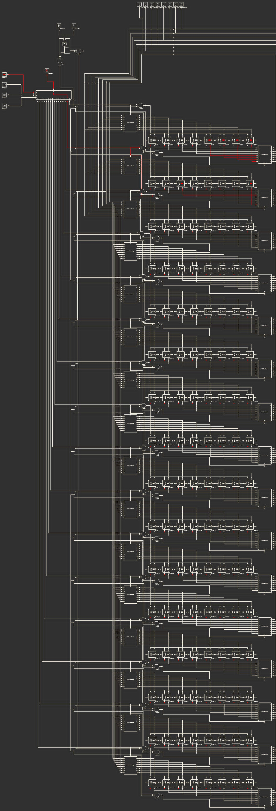

# 16-Byte-RAM 
*A 16-byte addressable RAM built using D Flip-Flops on Logic Simulator Pro*

---

## Overview

**MiniRAM-16** is a simple yet functional 16-byte RAM module built using the **Logic Simulator Pro** mobile app. It supports **both read and write operations**, and is **addressed via a 4-bit bus**. The design uses **D flip-flops** as the core memory elements and demonstrates how RAM works at the logic gate level.

This project aims to simulate real-world memory behavior on a low-level logic simulator, making it a valuable learning tool for digital electronics and computer architecture.

---

## Features

- 🧮 **16 Bytes of Memory** (128 bits)
- ✍️ **Write Operation** via input bus and write-enable signal
- 📖 **Read Operation** via address bus and read-enable
- 🧠 **Addressed by a 4-bit Bus**
- 🔁 Built using **D Flip-Flops**
- 📱 Created on **Logic Simulator Pro** (Android)
- ⏱ Optional **Clocked operation** (can be synchronous)

---

## 🧩 Components Used

- D Flip-Flops
- 4-to-16 Decoder (for addressing)
- Multiplexer (for read operation)
- Input Bus (4-bit Address, 8-bit Data)
- Control Signals: `Write Enable`, `Read Enable`
- Output Bus (8-bit)

---

## 🚀 How to Use

1. **Open Logic Simulator Pro** on your Android device.
2. **Load the project file** (or recreate it using the diagram).
3. **Set the 4-bit address** via the address input bus.
4. Use `Write Enable` to write data into memory.
5. Use `Read Enable` to read data from the selected address.

💡 *Make sure to toggle the correct control signals to avoid race conditions.*

---

## 🧠 Future Work

- ✅ Expand RAM size to 64 or 256 bytes
- 🔗 Connect with a custom-built **8-bit CPU**
- 🧮 Add support for bi-directional data bus
- 💾 Build a simple memory controller module

---

## 🙋 Author

**Created by:** *Abhinav Sharma*  
**Built with:** Logic Simulator Pro (Android)  
Feel free to use or modify this project for learning or educational purposes.

##
